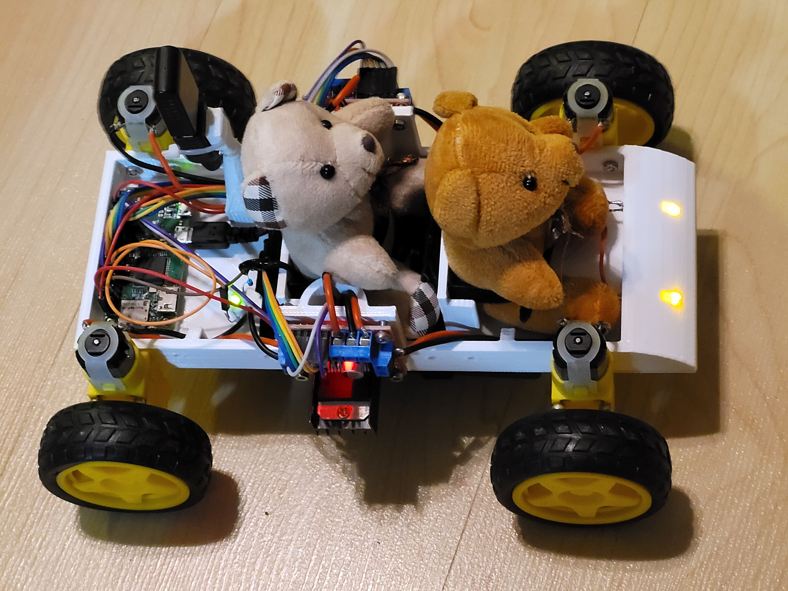

# pizerocar

## Use
Run ```car_controller.py``` on the Raspberry Pi Zero

## Building the car
The 3D printer files will be available on Thingiverse and in the ```hardware``` folder, along with a bill of materials.

## Example
Here is the final product, with a driver and passenger:
